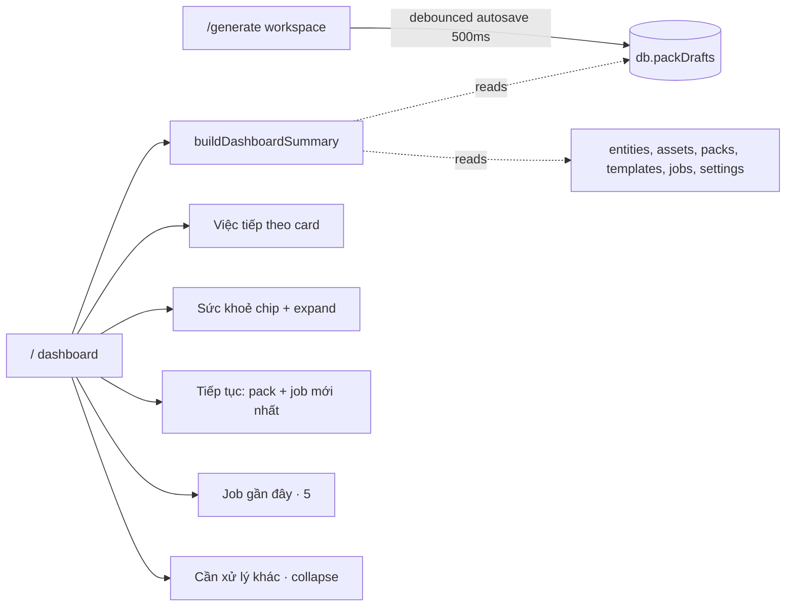

# Dashboard redesign — design spec

**Date:** 2026-05-20
**Status:** Approved (brainstorming)
**Scope:** `src/routes/index.tsx`, `src/lib/dashboardSummary.ts`, new `packDrafts` Dexie store, autosave wiring in `/generate` workspace.

## Goal

Đổi trang `/` từ **inventory dashboard** (đếm tài sản trong kho) sang **command center** (operator vào app là biết hôm nay làm gì, có gì sai, đang làm dở ở đâu).

## Operator usage profile

Một ngày làm việc thường có 4 nhịp:
1. Mở app → "Hôm qua có sai gì? Hôm nay làm gì trước?"
2. Kiểm dữ liệu → sheet mới đủ ảnh chưa, dòng nào lỗi
3. Tiếp tục việc dở → pack/preset đang bind, draft chưa lưu
4. Tạo & xuất → generate, kiểm cảnh báo, export ZIP

Trang hiện tại (4 stat card đếm số + 4 status card lặp module + cảnh báo cuối trang) chỉ trả lời nhịp 1 ở mức thô. Trang mới phải:
- Đề xuất rõ "việc tiếp theo" theo rule có thứ tự (giảm tải nhận thức)
- Cho phép tiếp tục pack đang bind dở (hiện tại không persist)
- Show job gần đây với link "Mở" tới `/history` để tải ZIP/inspect (Tải ZIP inline defer phase sau)
- Sức khoẻ hệ thống ngắn gọn (chip), expand khi cần chi tiết

## Out of scope (defer)

- Filter / search trong job gần đây — sẽ dùng `/history`
- Lưu position editor (`activePageIdx`, `selectedSlotIds`) — chỉ packOv + previewPageDrafts
- Drag-reorder các section dashboard
- Push notifications cho cảnh báo
- Multi-user activity feed
- I18n header chào theo giờ

## Architecture overview



## Trang `/` — cấu trúc 6 section

```
┌─────────────────────────────────────────┐
│ Header: Tổng quan · tóm tắt · [actions] │
├─────────────────────────────────────────┤
│ ┃ VIỆC TIẾP THEO                        │ ← card to, gradient
│ ┃ "Tải 12 ảnh từ sheet 'Quán mới'"      │
│ ┃ [Tải ảnh từ sheet ›]                  │
├─────────────────────────────────────────┤
│ Sức khoẻ: ●Data ●Ảnh⚠ ●Khuôn ●AI✗      │ ← chip, click expand
├─────────────────────────────────────────┤
│ ┌─Pack đang bind─┬─Job mới nhất────┐   │
│ │ Quán đêm Q3    │ "...v2" 28 trang│   │
│ │ ▓▓▓░░░░░ 3/8   │ 3⚠ · 15p trước  │   │
│ │ Tiếp tục ›     │ Mở job ›        │   │
│ └────────────────┴─────────────────┘   │
├─────────────────────────────────────────┤
│ Job gần đây (5)                         │
│ ● Quán đêm Q3 v2  15p · 28 · 3⚠  [ZIP] │
│ ● Brunch HCM      2h · 16        [ZIP] │
│ ...                                     │
├─────────────────────────────────────────┤
│ ▾ Cần xử lý khác (2)                    │ ← collapsed default
└─────────────────────────────────────────┘
```

### 1. Header

- Tiêu đề: **"Tổng quan"** (bỏ chào theo giờ — tránh i18n, tránh re-render mỗi phút).
- 1 dòng tóm tắt: `"{N} việc cần xử · job mới nhất {khi nào}"` (`{khi nào}` = relative time).
- Action buttons (right):
  - `Nhập dữ liệu` (outline) → `/data`
  - `Tải ảnh từ sheet` (outline, chỉ hiện khi `driveDownloadCandidateCount > 0`) → `/data?tab=images`
  - `Tạo nội dung` (primary) → `/generate`

### 2. Việc tiếp theo (`NextActionCard`)

Card to với gradient nền (`from-blue-50 to-blue-100/40 dark:from-blue-500/10 dark:to-blue-500/5`).

**Rule chọn — pick item đầu tiên match (priority cao → thấp):**

| # | Điều kiện | Title | Action | Tone |
|---|-----------|-------|--------|------|
| 1 | `entities.length === 0` | "Nhập dữ liệu để bắt đầu" | → `/data` | danger |
| 2 | `packTemplates.length === 0 \|\| pageTemplates.length === 0` | "Tạo bộ khuôn đầu tiên" | → `/templates` | danger |
| 3 | `driveDownloadCandidateCount > 0` | "Tải N ảnh từ sheet" (N = count) | → `/data?tab=images` | warning |
| 4 | có `incompletePack` (xem dưới) | "Tiếp tục bind {packName} · {bound}/{total} trang" | → `/generate?pack=...` | warning |
| 5 | `latestJobWarnings > 0` | "Xem N cảnh báo trong job '{name}'" | → `/history` | warning |
| 6 | `!aiConfigured` | "Cấu hình AI để dùng caption tự động" | → `/settings` | neutral |
| ∅ | (mọi thứ OK) | "Sẵn sàng tạo nội dung" | → `/generate` | success |

- **Không có dismiss** (chốt: A trong Q rule).
- Title in đậm 16px, detail 12px muted, button primary nhỏ + button "Bỏ qua" outline (chỉ hiện cho item ≥4 — danger không cho bỏ qua).

### 3. Sức khoẻ — 4 chip

Layout: hàng ngang, gap nhỏ. Mỗi chip có `●` + tên + số ngắn.

| Chip | Đỏ nếu | Vàng nếu | Xanh ngược lại |
|------|--------|----------|----------------|
| Dữ liệu | `entities.length === 0` | `activeEntities < 5` | |
| Ảnh | `assets.length === 0` | `entitiesWithoutAssets > 0 \|\| linkAssets > 0 \|\| brokenAssets+missingAssets > 0` | |
| Khuôn | `packTemplates.length === 0` | `mappedSlots < totalSlots * 0.3` | |
| AI | `!aiConfigured` | (không có) | |

**Click chip → expand inline (chốt: C).**
- Click chip → bung 1 panel ngay dưới hàng chip với grid 2-4 cell (số chi tiết) + 1 button mở trang liên quan.
- Click cùng chip lần nữa hoặc chip khác → toggle / chuyển expand.
- Một thời điểm chỉ 1 chip expand.

Số chi tiết mỗi chip:

| Chip | Cells |
|------|-------|
| Dữ liệu | Tổng dòng, Đang dùng, Đối tác, Bảng |
| Ảnh | Tổng ảnh, Trong máy, Link, Thiếu (hl đỏ nếu > 0) |
| Khuôn | Bộ khuôn, Trang, Ô đã gắn `M/N`, Khuôn đổ |
| AI | Trạng thái cấu hình, baseUrl rút gọn, model |

### 4. Tiếp tục — 2 cột

Grid 2 cột (1 cột < md). Cell card border subtle.

#### 4a. Pack đang bind dở

**Rule chọn pack hiển thị (chốt: 2C, 3A):**
1. Ưu tiên `incompletePack` = pack có `0 < boundCount < totalBindable` *theo packDrafts* (xem schema dưới). Sort theo `lastOpenedAt` desc, lấy top 1.
2. Fallback `recentPack` = pack có `lastOpenedAt > latestJobCreatedAt(pack)` (mở mà chưa generate sau đó). Top 1.
3. Nếu không có cả 2 → ẩn cell, biến hàng "Tiếp tục" thành 1 cột (job mới nhất chiếm full width).

Hiển thị:
- Label nhỏ `▶ Đang bind` (incomplete) hoặc `▶ Đã mở gần đây` (fallback)
- Tên pack
- Progress bar `boundCount / totalBindable` + text `"{bound}/{total} ô"`
- Link `Tiếp tục bind ›` → `/generate?pack=<packTemplateId>`

#### 4b. Job mới nhất

Hiển thị job đầu trong `jobs` (đã sort desc by `createdAt`).
- Label `⏱ Job mới nhất`
- Tên + `{N} trang`
- Trạng thái: nếu có cảnh báo thì `{warningCount} cảnh báo` đỏ; nếu OK thì `Hoàn tất` xanh
- Relative time
- Link `Mở job ›` → `/history` với highlight `jobId`

Nếu `jobs.length === 0` → cell hiển thị empty state "Chưa có lượt tạo nào".

### 5. Job gần đây (5 dòng)

Card với header + list 5 row compact.

Mỗi row:
- Status dot (đỏ nếu có cảnh báo, xanh nếu OK, vàng nếu draft)
- Tên job (truncate)
- Meta: `{relativeTime} · {pageCount} trang · {warningCount}⚠` (cảnh báo ẩn nếu 0)
- Action `Mở ›` (link) → `/history` với highlight `jobId` (Tải ZIP inline defer)

> **Defer:** Inline "Tải ZIP" từ dashboard (re-render artifacts) defer sang phase sau. Phase đầu chỉ là link "Mở" đưa tới `/history` highlight job — bấm Tải ZIP từ đó (đã có sẵn).

Footer: link `Xem lịch sử ›` → `/history`.

Hide section nếu `jobs.length === 0`.

### 6. Cần xử lý khác — collapse

Chỉ chứa các issue **chưa** thành "Việc tiếp theo" (tránh duplicate).

- Header có badge số `Cần xử lý khác (N)`. Click toggle expand.
- Mặc định collapse khi `N >= 3`, expand khi `N <= 2`.
- Mỗi issue: dot tone + label + detail + link `Mở`.
- Hide section nếu `N === 0`.

## Data model — `db.packDrafts`

### Schema

```ts
// src/models/index.ts
export interface PackDraftState {
  packTemplateId: ID;       // PK
  packOv: PackBindOverrides; // = Record<pageTemplateId, Record<slotId, bindingPath>>
  previewPageDrafts: Record<string, PageTemplate>;
  lastOpenedAt: number;
  updatedAt: number;
}
```

### Dexie migration

Bump version trong `src/storage/db.ts`:

```ts
this.version(N + 1).stores({
  packDrafts: "packTemplateId, lastOpenedAt, updatedAt",
});
```

Index `lastOpenedAt` để dashboard có thể `.orderBy("lastOpenedAt").reverse()` nhanh.

### Autosave wiring trong `/generate` (PackTabContent + workspace)

1. **Khi user chọn pack** (set `packId` non-empty):
   ```ts
   await db.packDrafts.put({
     packTemplateId: packId,
     packOv: existing?.packOv ?? {},
     previewPageDrafts: existing?.previewPageDrafts ?? {},
     lastOpenedAt: Date.now(),
     updatedAt: Date.now(),
   });
   ```
2. **Khi `packOv` hoặc `previewPageDrafts` đổi**: debounced 500ms autosave.
   - Reuse pattern `useDesignAutosave` của Phase 2+3 (queue + signature) hoặc đơn giản hơn: 1 `useEffect` watch state, set `setTimeout`, clear trên cleanup.
3. **Khi user clear pack hoặc clear bindings** (đã có nút "Xoá tất cả binding"):
   - Cập nhật `packOv = {}` thay vì xóa record (lastOpenedAt vẫn hữu ích).
4. **Khi user generate thành công** (`onGenerate` push job):
   - **Không** xóa draft — operator có thể tweak rồi generate lại; draft là source of truth của "binding cuối cùng cho pack này".

### `buildDashboardSummary` mở rộng

Thêm input:

```ts
export interface DashboardSummaryInput {
  // ...existing fields
  packDrafts: PackDraftState[];
}
```

Thêm output:

```ts
{
  // ...existing
  incompletePack?: {
    packTemplateId: string;
    packName: string;
    boundCount: number;
    totalBindable: number;
    lastOpenedAt: number;
  };
  recentPack?: { /* same shape */ };
  recentJobs: Array<{
    jobId: string;
    name: string;
    pageCount: number;
    warningCount: number;
    createdAt: number;
    status: "draft" | "generated" | "exported";
  }>; // top 5
  nextAction: {
    id: "no-data" | "no-template" | "download-images" | "incomplete-pack"
        | "warnings" | "ai" | "ready";
    title: string;
    detail: string;
    to: string;
    search?: Record<string, unknown>;
    tone: "danger" | "warning" | "neutral" | "success";
  };
}
```

`incompletePack` resolution:

```ts
function pickIncompletePack(packDrafts, packs, pageTemplates): IncompletePack | undefined {
  const candidates = packDrafts
    .map(draft => {
      const pack = packs.find(p => p.packTemplateId === draft.packTemplateId);
      if (!pack) return null;
      const bindable = countBindableSlots(pack, pageTemplates);
      const bound = countBoundSlots(draft.packOv);
      if (bound === 0 || bound >= bindable) return null;
      return { ...draft, packName: pack.name, boundCount: bound, totalBindable: bindable };
    })
    .filter(Boolean);
  return candidates.sort((a, b) => b.lastOpenedAt - a.lastOpenedAt)[0];
}
```

`recentPack` resolution: tương tự nhưng `bound === 0 || bound === bindable` đều cho qua, miễn là `lastOpenedAt > latestJobCreatedAtForPack`.

## Component structure

```
src/routes/index.tsx           — Dashboard route, glue
src/features/dashboard/
  ├─ NextActionCard.tsx
  ├─ HealthChipRow.tsx          — chips + expand panel
  ├─ ResumeSection.tsx          — pack draft cell + latest job cell
  ├─ RecentJobsList.tsx
  └─ RemainingIssues.tsx
src/lib/dashboardSummary.ts     — pure logic, mở rộng input/output
src/lib/dashboardSummary.test.ts — unit tests cho rule logic
```

Các sub-component nhận props từ `dashboard` summary, không tự query DB. `index.tsx` là 1 component query DB + map xuống.

### Visual reuse

- Tone palette: tái dùng `STATUS_TONE_CLASSES` / `STATUS_DOT_CLASSES` hiện có trong `index.tsx`.
- Card / Button: shadcn primitives sẵn có.
- Progress bar: dùng `Progress` từ shadcn (đã có trong project).

## Loading & empty states

- **Khi `dashboard === undefined`** (live query chưa resolve): skeleton cho từng section (`NextAction` + 4 chip + 2 resume cell + 5 row job).
- **Workspace trống** (`entities=0, assets=0, packs=0, jobs=0`):
  - Header chỉ giữ "Nhập dữ liệu" + "Tạo nội dung"
  - NextAction = "Nhập dữ liệu để bắt đầu"
  - HealthChip: tất cả đỏ
  - Resume + Job gần đây: hide
  - Remaining issues: hide

## Testing strategy

### Unit (`dashboardSummary.test.ts`)

- `nextAction` rule order: 7 case, mỗi case set state thoả 1 priority, expect `nextAction.id` đúng.
- `incompletePack` chọn đúng draft có `0 < bound < bindable`, sort by `lastOpenedAt` desc.
- `recentPack` fallback đúng khi không có incomplete.
- Health chip tone: edge case `entities=0`, `linkAssets>0 nhưng full local`, etc.
- `recentJobs` slice 5, sort desc.
- Workspace trống → `nextAction.id === "no-data"`.

### Component (`Dashboard.test.tsx`)

- Render skeleton khi summary undefined.
- Click chip → expand, click khác → swap, click cùng chip → collapse.
- "Cần xử lý khác" mặc định collapse khi N >= 3.

### Manual smoke

- `/generate` mở pack, bind 2 slot, đóng tab → reopen `/` thấy pack trong "Tiếp tục"
- Tải ảnh xong → next action chuyển sang #5 hoặc #6
- Job có cảnh báo → "Job mới nhất" hiển thị warning count đúng

## Risks & mitigations

| Risk | Mitigation |
|------|------------|
| Autosave debounce gây race với user navigate sang trang khác | Reuse pattern `useDesignAutosave`: flush on unmount + beforeunload guard |
| `packDrafts` phình to khi user mở 100 pack | Cleanup: `lastOpenedAt < now - 30 days` xóa khi dashboard load (low priority) |
| Migration Dexie failure trên prod data | Test migration với fixture; rollback path: dashboard fallback "recent pack only" nếu store rỗng |
| `Tải ZIP` inline từ dashboard cần re-render → chậm | Defer phase sau. Phase đầu chỉ link "Mở ›" tới `/history`. |

**Decision on row action:** Mỗi row job ở dashboard có link `Mở ›` → `/history?job=<jobId>`. Trang history (đã có) chịu trách nhiệm Tải ZIP / inspect.

## Acceptance criteria

1. Trang `/` không còn 4 stat card thuần đếm.
2. Card "Việc tiếp theo" luôn hiển thị 1 hành động cụ thể, đúng theo rule 1→7.
3. Click chip sức khoẻ bung panel chi tiết, click khác swap, click cùng collapse.
4. Mở pack ở `/generate`, bind ít nhất 1 ô, quay về `/` thấy pack trong section "Tiếp tục" với progress đúng.
5. `db.packDrafts` có schema mới và migration không phá data cũ.
6. Tests `dashboardSummary.test.ts` cover 7 rule case + incomplete pack edge cases — pass.
7. Build + tsc + lint pass; số test tăng (mới ≥10 case so với hiện 2).

## Implementation phases (preview cho writing-plans)

1. **Schema + autosave** — model + Dexie migration + autosave hook trong `/generate`.
2. **Summary logic** — mở rộng `buildDashboardSummary` + tests.
3. **Components** — 5 sub-component dashboard.
4. **Glue & polish** — `index.tsx` mới, skeleton, edge cases.
5. **Verify** — tsc + tests + lint + build + manual smoke + code-reviewer.
