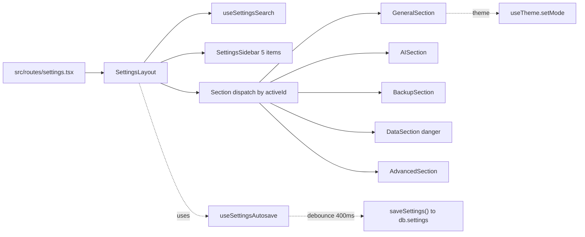

# Settings page redesign — design spec

**Date:** 2026-05-21
**Status:** Approved (brainstorming)
**Scope:** `src/routes/settings.tsx` (replace), new `src/features/settings/` modules, `AppSettings` model extension, `useTheme` integration.

## Goal

Đổi `/settings` từ trang scroll dài 779 LOC sang **command-style settings**: sidebar trái 5 mục, search field ở header, autosave per-field, destructive zone tách hẳn, expose feature đã có nhưng ẩn (theme switcher, drive folder URL, caption provider) và thêm Generate defaults.

## User pain points (current)

1. Phải scroll dài để tìm field — không có navigation.
2. Save dồn vào 1 nút cuối trang — dễ quên, mất khi rời trang.
3. 4 card xoá data destructive nằm ngay trang chính, có nguy cơ bấm nhầm.
4. AI provider thiếu hỗ trợ — không có show/hide API key.
5. Field đã có trong model nhưng không hiện ra UI: `theme`, `driveRootFolderUrl`, `captionProvider`.

## Architecture



- Mỗi section là 1 component riêng, **pure presentational**, nhận `settings` + `update(patch)`.
- `useSettingsAutosave({settings, dirtySignature})` — debounce 400ms, sync state về `db.settings` qua `saveSettings`. Trả `status: idle|saving|saved|error`.
- Theme switcher đồng bộ 2 nguồn: cập nhật `AppSettings.theme` (persist DB) + gọi `useTheme().setMode()` (apply class + localStorage).
- Search filter: input ở header → match `label` + `keywords[]` từ static index → highlight + scroll-to-section.

## Layout

```
┌─ Cài đặt    [search ⌕ "model" hoặc "drive"...]    ┐
├──────────────┬────────────────────────────────────┤
│ ▸ Chung      │  AI Provider                       │
│ ▸ AI         │                                    │
│ ▸ Sao lưu    │  Preset: [DeepSeek ▾]   ✓ Đã lưu  │
│ ▸ Dữ liệu ⚠  │  Base URL: [...]                   │
│ ▸ Nâng cao   │  Model: [...]                      │
│              │  ...                               │
└──────────────┴────────────────────────────────────┘
```

- Sidebar trái 200px, sticky. Active highlight + dot status nhỏ ("Đang lưu" / "Đã lưu" / "Lỗi").
- Search field ở header — gõ → filter index → jump tới section đầu tiên match.
- Mobile: sidebar collapse thành dropdown `<select>` ở đầu content.

## 5 sections

### 1. Chung (General)
- **Theme** — radio: light / dark / system (`AppSettings.theme` + `useTheme.setMode`)
- **Ngôn ngữ** — read-only "Tiếng Việt" (hiện `language: "vi"` không có mục đổi)
- **Khổ ảnh mặc định** — width / height / exportScale
- **Drive root folder URL** — input text, để paste link Drive root cho flow tải ảnh

### 2. AI
- Preset dropdown (DeepSeek / Lovable / Custom)
- Base URL · Model · Vision model (optional)
- API key (password input, nút show/hide)
- "Test kết nối" button — kết quả inline; giữ nguyên flow `testAiConfig`
- Hint của preset

### 3. Sao lưu & khôi phục (Backup)
- Card "Tạo backup": 3 chip phạm vi (systemData/packTemplates/generatePresets) + switch include images → nút Tải
- Card "Khôi phục": file picker → AlertDialog merge/replace
- Logic copy nguyên từ trang hiện tại (không thay flow).

### 4. Dữ liệu (Data — destructive)
- Banner cảnh báo "Vùng nguy hiểm" ở đầu section
- 4 row destructive (data / ảnh / sheet / khuôn mẫu) như cũ:
  - Xoá ảnh
  - Xoá dữ liệu sheet
  - Xoá tất cả (data + ảnh)
  - Xoá khuôn mẫu (packs/pages/designs/jobs/presets/symbols/overrides)
- Mỗi row: dialog confirm + undo toast 15s (giữ pattern hiện tại)

### 5. Nâng cao (Advanced)
- **Generate defaults** — 4 input:
  - `defaultMaxEntities` (số trang mỗi mẻ generate)
  - `defaultPrioritizePartner` (switch)
  - `defaultOnlyPartner` (switch)
  - `defaultPartnerQuotaPerPage` (số ô đối tác mỗi trang)
- **Caption provider** — select local/openai (đã có trong model)

## Data model

### `AppSettings` (modify)

```ts
export interface GenerateDefaults {
  maxEntities: number;
  prioritizePartner: boolean;
  onlyPartner: boolean;
  partnerQuotaPerPage: number;
}

export interface AppSettings {
  language: "vi";
  captionProvider: "local" | "openai";
  captionApiKey?: string;
  exportScale: number;
  defaultCanvas: CanvasSize;
  theme?: "light" | "dark" | "system";  // was "light" | "dark"
  ai?: AiProviderConfig;
  driveRootFolderUrl?: string;
  driveDownloadCheckpoint?: DriveDownloadCheckpoint;
  generateDefaults?: GenerateDefaults;  // new
}
```

### `DEFAULTS` (modify)

```ts
const DEFAULTS: AppSettings = {
  language: "vi",
  captionProvider: "local",
  exportScale: 2,
  defaultCanvas: { width: 1588, height: 2248, background: "#ffffff" },
  theme: "system",  // was "light"
  driveRootFolderUrl: "https://drive.google.com/drive/folders/1f_gOfPyy0QbezU4y_W6EtESpo4Z_Hz9k?hl=vi",
  generateDefaults: {
    maxEntities: 5,
    prioritizePartner: true,
    onlyPartner: false,
    partnerQuotaPerPage: 1,
  },
};
```

## Search index

Static array trong `src/lib/settingsSearchIndex.ts`:

```ts
export interface SearchEntry {
  sectionId: "general" | "ai" | "backup" | "data" | "advanced";
  fieldId: string;
  label: string;
  keywords: string[];  // both vi + en aliases
}

export const SETTINGS_SEARCH_INDEX: SearchEntry[] = [
  { sectionId: "general", fieldId: "theme", label: "Theme", keywords: ["theme", "giao diện", "dark", "sáng", "tối", "system"] },
  { sectionId: "general", fieldId: "canvas", label: "Khổ ảnh mặc định", keywords: ["canvas", "width", "height", "khổ ảnh", "size"] },
  { sectionId: "general", fieldId: "exportScale", label: "Độ nét file tải xuống", keywords: ["scale", "export", "độ nét", "resolution"] },
  { sectionId: "general", fieldId: "drive", label: "Drive root folder", keywords: ["drive", "google drive", "folder"] },
  { sectionId: "ai", fieldId: "preset", label: "AI preset", keywords: ["preset", "deepseek", "openai", "lovable"] },
  { sectionId: "ai", fieldId: "baseUrl", label: "Base URL", keywords: ["base url", "endpoint", "api"] },
  { sectionId: "ai", fieldId: "model", label: "Model", keywords: ["model", "ai model"] },
  { sectionId: "ai", fieldId: "visionModel", label: "Vision model", keywords: ["vision", "image", "ảnh"] },
  { sectionId: "ai", fieldId: "apiKey", label: "API key", keywords: ["api key", "key", "token"] },
  { sectionId: "backup", fieldId: "scope", label: "Phạm vi backup", keywords: ["backup", "sao lưu", "scope"] },
  { sectionId: "backup", fieldId: "import", label: "Nhập backup", keywords: ["import", "khôi phục", "restore"] },
  { sectionId: "data", fieldId: "clearAll", label: "Xoá tất cả dữ liệu", keywords: ["xoá", "delete", "clear"] },
  { sectionId: "data", fieldId: "clearImages", label: "Xoá ảnh", keywords: ["ảnh", "images", "delete"] },
  { sectionId: "data", fieldId: "clearTemplates", label: "Xoá khuôn mẫu", keywords: ["khuôn", "templates", "packs"] },
  { sectionId: "advanced", fieldId: "generateDefaults", label: "Generate defaults", keywords: ["generate", "max entities", "partner", "default"] },
  { sectionId: "advanced", fieldId: "captionProvider", label: "Caption provider", keywords: ["caption", "provider", "openai"] },
];
```

## Component contracts

### `useSettingsAutosave`

```ts
interface AutosaveStatus {
  state: "idle" | "saving" | "saved" | "error";
  lastSavedAt: number | null;
  errorMessage?: string;
}

export function useSettingsAutosave(settings: AppSettings | null): AutosaveStatus;
```

- Debounce 400ms, signature = `JSON.stringify(settings)`.
- Skip save khi `settings === null` hoặc signature trùng `lastSavedSignatureRef`.
- Flush on unmount.

### `useSettingsSearch`

```ts
interface SearchResult {
  matches: SearchEntry[];
  primarySectionId: SectionId | null;
}

export function useSettingsSearch(query: string): SearchResult;
```

- Empty query → `{ matches: [], primarySectionId: null }`.
- Match ALL từ trong query phải có trong (label OR keywords) — case-insensitive, normalize Vietnamese diacritics.
- `primarySectionId` = section chứa match đầu tiên.

### `SettingsSidebar`

```tsx
interface SidebarProps {
  activeId: SectionId;
  onChange: (id: SectionId) => void;
  saveStatus: AutosaveStatus["state"];
  matchCounts?: Partial<Record<SectionId, number>>;  // for search
}
```

### Section components

Mỗi section nhận:

```tsx
interface SectionProps {
  settings: AppSettings;
  update: (patch: Partial<AppSettings>) => void;
  searchHighlightFieldId?: string;
}
```

`DataSection` thêm trace state internal cho dialog confirm; không nhận callback từ ngoài.

## Loading & empty states

- `settings === null` → skeleton: sidebar render với `saveStatus: "idle"`, content area dùng skeleton placeholders cho 3-4 field.
- Lần đầu mở sau update — `DEFAULTS` đã có `theme: "system"` và `generateDefaults`, không cần migration script.

## Testing strategy

### Unit
- `useSettingsAutosave.test.ts` — debounce, gộp change, flush on unmount, no-op khi signature trùng (3-4 case).
- `settingsSearchIndex.test.ts` — match query "model" trả ai/model + ai/visionModel; "drive" trả general/drive; empty → no match (3 case).

### Component (smoke)
- `SettingsSidebar.test.tsx` — render 5 item, click đổi active.

### Manual
- Mở `/settings` → click 5 mục, content đổi.
- Đổi theme → html class đổi ngay + reload vẫn giữ.
- Search "model" → highlight section AI, jump tới.
- Sửa Base URL → đợi 500ms → badge "Đã lưu" hiện.
- Click "Xoá tất cả" → dialog → confirm → toast undo trong 15s.

## Risks & mitigations

| Risk | Mitigation |
|------|------------|
| Autosave race khi user gõ nhanh + đóng tab | Flush on unmount + beforeunload guard (pattern từ `usePackDraftAutosave`) |
| Theme 2 nguồn (`AppSettings.theme` + localStorage) lệch nhau | Task 7 logic: nếu localStorage rỗng đọc từ settings; toggle ở header save vào settings + localStorage |
| Generate defaults không break PackTabContent (đang dùng hardcoded) | Đợt này chỉ thêm field; không đụng PackTabContent. Wire vào generate flow để đợt sau |
| `driveDownloadCheckpoint` không có UI | Bỏ ngoài UI Settings — chỉ field internal, không expose |
| Backup section có flow phức tạp (3 chip + switch + 2 card + AlertDialog) | Copy nguyên logic + JSX từ `settings.tsx` cũ vào `BackupSection.tsx` — không refactor flow |

## Acceptance criteria

1. `/settings` không còn scroll dài >1 màn hình ở section Chung/AI/Advanced.
2. Sidebar 5 mục, click đổi nội dung tức thì.
3. Search "model" jump tới AI section, highlight Model field.
4. Sửa bất kỳ field text/select → 400ms sau badge "Đã lưu" hiện ở sidebar.
5. Theme radio đổi → html class đổi ngay; reload vẫn giữ.
6. Destructive section có banner cảnh báo, 4 button vẫn confirm + undo 15s.
7. `npx tsc --noEmit` clean, tests pass, lint 0 errors, build OK.

## Out of scope (defer)

- Wire `generateDefaults` vào `/generate` UI — đợt sau
- Custom keyboard shortcuts editor
- Multi-language switch (chỉ vi)
- Export/import settings JSON riêng (đã có trong systemBackup)
